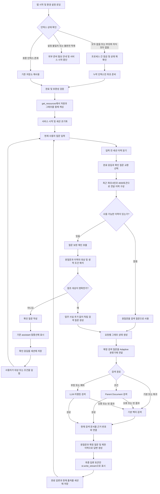

# Adaptive RAG Streamlit 챗봇 작업계획서

## 1. 목표와 범위

[mini_project_final.ipynb](../mini_project_final.ipynb)의 Adaptive RAG를 최종 검색·답변 엔진으로 채택하고, [6_chat.py](../../../day03/streamlit/6_chat.py)의 화면 구성에 연결한다. 이 문서는 구현 전 작업계획서이며 앱 코드를 작성하거나 인덱스를 변경하지 않는다.

기본 벡터 검색, 조건 질문의 Parent Document 검색, 부정/예외 질문의 LLM 리랭킹, 확신도 0.8 미만·분류 실패·특수 검색 실패 시 BASE 복귀 정책을 유지한다. 이전 대화를 참조하는 질문 보완 단계와 최종 답변 토큰 스트리밍을 추가한다.

PDF 파싱·청킹·인덱스 준비 코드는 별도 모듈로 분리하되, 앱 시작 시 10항의 상태별 정책에 따라 누락된 인덱스를 최초 준비한 후 서비스를 시작한다. 운영 중 인덱스 재구축은 수행하지 않는다. 벤치마크·골든셋 생성·RAGAS 평가와 그 UI는 Streamlit에 구현하지 않는다.

## 2. UI 정책

`6_chat.py`의 요소와 배치를 그대로 따른다.

| 위치 | 유지할 요소 | 적용 정책 |
|---|---|---|
| 본문 상단 | `st.title` | 제목 문구만 Hmall 협력사 챗봇에 맞게 변경 |
| 제목 아래 | 기존 안내 expander | 같은 위치·개수 유지, 설명 문구만 실제 동작에 맞게 변경 |
| 본문 | `st.chat_message`와 `st.markdown` | 저장된 사용자·assistant 메시지를 순서대로 표시 |
| 입력 | `st.chat_input` | 기존 위치와 형태 유지 |
| 새 답변 | `st.write_stream` | 실제 답변 생성 토큰을 즉시 표시 |
| 사이드바 | 상태 헤더·메시지 수·대화 초기화·구분선·caption | 기존 요소만 유지, 모사 응답 안내 문구를 실제 RAG 안내로 교체 |

추가 탭, 출처 패널, 검색 경로 표시, 모델 선택, 업로드, 진행 상태 위젯, 캐시 초기화 버튼, 별도 평가 화면을 만들지 않는다. 답변의 `[n]` 인용은 기존 답변 본문에 표시하고 상세 출처는 세션 상태에만 저장한다. 오류와 확인 질문도 기존 assistant 말풍선 안에서 안내한다.

## 3. 파일 분리 정책과 권장 파일명

`day05/mini_project_1/streamlit/`에 Streamlit 관련 파일을 모아 관리한다. 노트북과 기존 데이터는 상위 `mini_project_1/`에 유지한다. 앱은 노트북을 실행하거나 노트북의 전역 변수를 읽지 않는다. 서비스에 필요한 정의만 Python 모듈로 옮긴다.

| 권장 파일명 | 책임 | 포함하지 않을 내용 |
|---|---|---|
| `streamlit_chat.py` | UI, 세션 상태, 캐시 진입 함수, 스트림 표시 | 검색 알고리즘·파싱·평가 구현 |
| `rag_config.py` | 환경변수·모델·절대 경로·컬렉션·K·분류 기준·청크 설정 | UI, API 호출, DB 쓰기 |
| `adaptive_rag.py` | 스키마·프롬프트, 저장소 로딩·검증, 검색기·체인 구성, 그래프 구성 | Streamlit 의존성, PDF 적재, 벤치마크·RAGAS |
| `chat_service.py` | 이전 대화로 질문 보완, 그래프 스트림 소비, 요청 결과 구성 | UI 요소, 공유 대화 상태 |
| `prepare_index.py` | 앱 시작 전 상태 확인·자동 최초 준비 및 별도 명령 실행, PDF 파싱·청킹·BASE/부모·자식 적재 | 운영 중 재구축, 벤치마크·RAGAS |
| `requirements_streamlit.txt` | 앱과 사전 구축에 필요한 의존성 목록 | 평가 전용 의존성 |
| `README_streamlit.md` | 환경 설정, 사전 구축, 실행법, 캐시·상태 정책 | 별도 평가 보고서 복제 |

데이터 경로는 기존 `day05/mini_project_1/files/`, `md_cache/`, `chroma_db/`, `parent_document_store/`를 재사용한다. 새 앱 폴더에 데이터를 복제하지 않는다. 노트북과 평가 결과는 실험·평가 자료로 유지하며 앱이 import하지 않는다. 추가 패키지 분리는 필요할 때만 수행하고, 처음부터 작은 기능마다 파일을 늘리지 않는다.

의존 방향은 `streamlit_chat.py → chat_service.py → adaptive_rag.py → rag_config.py`로 둔다. `streamlit_chat.py`의 캐시 함수는 `adaptive_rag.py`의 자원 준비·그래프 구성 함수를 호출한다. `prepare_index.py`는 설정과 필요한 저장소 유틸리티를 재사용하고, 앱은 서비스 시작 전 초기화 단계에서만 인덱스 상태 확인·최초 준비 함수를 호출한다. 질문 처리 경로에서는 호출하지 않는다.

## 4. 구현 대상과 캐싱

### 4.1. 공유 자원

`streamlit_chat.py`에 `@st.cache_resource`를 적용한 `get_resources(settings)`를 둔다. 내부에서 모델·임베딩 객체, BASE Chroma 연결, 부모 문서 저장소, 검색기, 질문 보완 체인·분류 체인·답변 체인, 컴파일된 그래프를 준비해 하나의 서비스 자원 묶음으로 반환한다. 객체마다 중복 캐시 함수를 만들 필요는 없다.

앱 시작 시 서비스 자원 캐싱에 앞서 10항의 상태별 정책으로 인덱스를 확인·최초 준비한다. 노트북 `prepare_adaptive_resources()`의 자동 구축 분기는 `prepare_index.py`의 `ensure_indexes()`로 옮긴다. 자원 캐시 함수는 이미 준비된 저장소의 로딩과 객체 구성만 수행한다. 인덱스 유효성 검사는 초기 준비 단계의 `ensure_indexes()`에 통합한다. 설정 불일치·불완전한 저장소는 자동 재구축하지 않고 외부 준비가 필요하다고 안내한다. 화면 재실행이나 캐시 미스만으로 운영 중 적재를 수행하지 않는다.

캐싱은 `get_resources(settings)` 한 함수에만 적용한다. 비밀값을 제외한 모델명·경로·K 등 설정 딕셔너리를 캐시 인자로 직접 전달하고 별도 서명·인덱스 버전 함수는 만들지 않는다. API 키는 환경에서 읽는다. 인덱스 교체는 앱을 중단한 뒤 외부에서 수행하고 앱 프로세스를 재시작해 자원을 다시 로딩한다. UI에는 캐시 관리 버튼을 추가하지 않는다.

### 4.2. 질문마다 실행할 작업

이전 대화 기반 질문 보완, 질문 분류, 질의 임베딩, 검색, LLM 리랭킹, 답변 생성은 요청마다 실행한다. 이 함수들에는 `st.cache_resource`를 적용하지 않는다. 캐싱 대상은 재사용 객체이며 질문에 대한 계산 결과가 아니다.

### 4.3. 세션별 상태

`st.session_state.messages`에 사용자·assistant 메시지를 저장한다. assistant 항목에는 `content`, `sources`, 원질문·검색용 질문, 검색 경로 및 복귀 정보 등 요청 결과를 함께 보관할 수 있다. 화면에는 기존 UI 정책에 따라 `role`, `content`만 사용한다.

출처는 `context_number`, `source`, `page`로 저장해 해당 답변의 인용 번호와 연결한다. 이전 답변 출처를 새 답변 출처로 재사용하지 않는다. 대화 초기화는 해당 세션의 메시지와 요청 상태를 비우며 공유 캐시·디스크 인덱스는 유지한다.

## 5. 후속 질문 처리

### 5.1. 처리 흐름

1. 입력 전의 완료된 대화에서 최근 최대 6턴을 선택한다. 확정한 이력 예산은 4,000토큰으로 두고 초과하면 오래된 턴부터 제외한다. 오류·미완료 assistant 응답은 제외하며 사용자 입력은 현재 질문과 중복 전달하지 않는다.
2. 이력이 없다면 원질문을 그대로 사용한다. 이력이 있으면 경량 모델의 구조화 출력으로 독립적인 검색 질문을 만든다.
3. 보완기는 이전 대화에서 대상·지시어·생략된 조건을 해석하되 정답이나 새로운 사실·요건을 추가하지 않도록 한다. 독립 질문이면 원문 의미를 유지한다.
4. `resolved_question`, `needs_clarification`, `clarification_question`을 반환한다. 참조 대상이 모호하면 검색을 실행하지 않고 기존 assistant 말풍선에서 확인 질문을 제시한다.
5. 확정된 검색 질문으로 Adaptive 분류·검색을 실행한다. 보완 단계의 모델 오류는 원질문으로 검색을 강행하지 않고 기존 말풍선에서 재입력 안내로 처리한다.

예를 들어 ‘NFC 주스의 착즙 소구에 필요한 자료는?’ 이후 ‘그 자료는 사진도 가능한가요?’는 앞선 대상과 자료를 명시한 독립 질문으로 바꾼다. 반면 대화에 여러 신청 절차가 나오고 ‘신청 기한은?’이라고만 묻는 경우에는 어떤 신청인지 확인한다.

최종 생성에는 원질문, 확정된 검색 질문, 제한된 대화 이력, 현재 검색 근거를 제공한다. 이전 대화는 질문 의도 해석에만 사용하고 업무 사실의 근거는 현재 검색 문서로 제한한다. 과거 assistant가 잘못 답한 내용을 새로운 근거처럼 사용하지 않도록 프롬프트에 명시한다.

### 5.2. 노트북 정책과의 관계

분류 프롬프트·검색 정책은 유지하되 입력은 확정된 검색 질문을 사용한다. 변경된 질문으로 경로가 달라질 수 있으므로 원질문과 검색 질문을 요청 결과에 함께 기록한다. 기존 단일 질문 평가 결과를 대화 기능까지 검증한 결과로 설명하지 않는다.

## 6. 답변 스트리밍

`run_adaptive_rag()`의 완성 답변 문자열을 잘라 출력하는 방식은 사용하지 않는다. 분류·검색·리랭킹을 마친 뒤 답변 모델이 생성하는 실제 토큰을 Streamlit에 전달한다.

권장 방식은 기존 그래프의 답변 노드를 유지하고 LangGraph의 메시지·상태 스트림을 소비하는 것이다. 답변 노드의 모델 호출을 스트리밍 가능한 설정으로 구성하고, `chat_service.py`에서 **최종 답변 생성 노드의 토큰만** 선택해 `st.write_stream`용 문자열 생성기로 전달한다. 분류·질문 보완·리랭킹의 구조화 출력과 내부 메시지는 화면에 표시하지 않는다.

사용 중인 LangGraph/LangChain 버전에서 메시지 스트림과 최종 상태를 함께 받을 수 있는지 먼저 확인한다. 가능하면 해당 방식으로 구현하고, 불가능하면 답변 체인의 `.stream()`을 명시적으로 소비해 토큰 이벤트와 완료 결과를 전달하는 구조로 조정한다. 두 경우 모두 최종 답변 모델은 요청당 한 번만 호출하고 출처·추적 정보도 동일 요청에서 수집한다.

토큰을 누적해 완성된 답변을 만들고 스트림 정상 종료 후 assistant 메시지와 출처를 함께 저장한다. 재실행 시에는 저장한 완성 답변을 그리며 모델을 다시 호출하지 않는다. 중간 실패 시 부분 응답을 정상 완료 답변으로 저장하거나 다음 질문의 대화 근거로 사용하지 않는다. 기존 assistant 말풍선에서 실패 사실을 알리고 자동으로 전체 생성을 재호출하지 않는다.

## 7. 작업 순서와 완료 기준

| 순서 | 작업 | 완료 기준 |
|---|---|---|
| 1 | 노트북 서비스 코드와 설정 추출 | 노트북 실행·전역 변수 없이 Python import 가능 |
| 2 | 초기 인덱스 준비 경로 분리 | 기존 로더·청킹 설정 보존, 10항에 따른 최초 준비, 운영 중 재구축 없음 |
| 3 | 저장소 로딩 및 캐시 구성 | 유효한 인덱스 로딩, 설정 불일치 안내, 동일 설정 재실행 시 객체 재사용 |
| 4 | 질문 보완 및 이력 관리 | 후속 질문의 대상 복원, 모호한 참조 확인, 다른 세션 이력 미사용 |
| 5 | 실제 토큰 스트리밍 연결 | 최종 답변 토큰만 표시, 답변 생성 중복 호출 없음, 완료 후 출처 저장 |
| 6 | `6_chat.py` UI 연결 | 동일 요소·배치 유지, 대화 재표시·메시지 수·초기화 정상 동작 |
| 7 | 동작 확인과 사용 안내 | 아래 시나리오 확인 및 README에 사전 구축·실행법 기록 |

동작 확인은 대화별 검색·출처 연결, 캐시 재사용, 스트림 이벤트 필터, 실패 처리를 중심으로 수행한다. 핵심 분기와 상태 처리는 모의 모델·검색기로 확인하고 실제 API 확인은 필요한 소수 질문에 한정한다. Streamlit에서 RAGAS나 벤치마크를 실행하지 않는다.

- 독립 질문에서 기존 기본·Parent Document·LLM 리랭킹 정책이 동작한다.
- 대상이 명확한 후속 질문은 이력을 반영하고, 모호한 질문은 확인을 요청한다.
- 분류·특수 검색 실패는 기존 정책대로 BASE로 복귀한다.
- 답변 토큰이 생성 중 표시되고 분류·리랭킹 내용은 표시되지 않는다.
- 앱 재실행 후 답변·출처가 유지되며 대화 초기화 후 이력이 사라진다.
- 두 세션의 이력·출처·토큰 계측이 섞이지 않는다.
- 시작 시 저장소가 없으면 최초 준비하고 호환되는 저장소는 로딩만 수행한다.
- 설정 불일치·불완전한 적재·운영 중 저장소 변경·스트림 실패를 기존 말풍선 안에서 안내한다.
- 동시 최초 실행에서는 프로세스 간 잠금으로 중복 적재를 방지한다.

권장 실행 명령은 현재 실습 작업 디렉터리 기준 `streamlit run day05/mini_project_1/streamlit/streamlit_chat.py`다. 경로는 `rag_config.py`의 `__file__` 위치를 기준으로 계산해 다른 작업 디렉터리에서도 같은 저장소를 사용한다. 구체적인 설치·사전 구축 명령은 실제 구현 후 `README_streamlit.md`에 확정한다.

## 8. 추가 지침 반영

1. **설정·인덱스 호환성과 자격증명 관리:** 모델명·임베딩 모델·컬렉션·부모/자식 설정을 검증하고 불완전한 최초 구축을 구분할 최소 준비 상태 표식만 유지하고 별도 인덱스 버전 체계는 만들지 않는다. API 키와 모델 설정은 `.env` 및 환경변수에서 읽고 화면·로그·코드에 출력하지 않는다. 앱 의존성 버전을 기록해 스트리밍과 저장소 로딩 동작을 재현한다.
2. **공유 자원의 동시 실행 관리:** 캐시 객체에 대화·요청 결과·누적 콜백을 저장하지 않는다. 노트북의 변경 가능한 `PreCountedEmbeddings.tokens`는 앱에서 제거하거나 요청별 계측으로 분리한다. 공유 검색기·저장소의 동시 접근 가능 여부를 확인하고 필요한 범위에만 동기화한다. 앱 운영 중 인덱스를 재구축하지 않는다.
3. **기존 실패 사례는 이번 작업에서 제외:** 항균 제품 등 이전 평가의 실패 사례 분석·개선·회귀 평가를 구현 범위에 넣지 않는다. 세션 분리, 스트리밍 완료·중단, 인덱스 로딩 등 앱의 정상 동작 확인은 수행한다.

## 9. 파일별 함수 구성

### `rag_config.py`

| 함수 | 역할 |
|---|---|
| `load_settings()` | `.env`·환경변수를 읽고 API 키·모델 등 필수 값을 확인한다. 파일 위치 기준으로 데이터 절대 경로를 계산하고 비밀값을 제외한 설정 딕셔너리를 반환한다. |

이미 설정된 환경변수가 우선이며 API 키는 환경에서 읽어 화면·로그·캐시 인자에 넣지 않는다. K=6, WIDE=12, 분류 확신도 기준 0.8, 이력 최대 6턴·4,000토큰을 설정에 명시한다.

### `prepare_index.py`

| 함수 | 역할 |
|---|---|
| `ensure_indexes(settings)` | 저장소 존재·설정 호환성·부모 연결·불완전 적재 여부를 확인한다. 10항의 상태별 정책에 따라 프로세스 간 잠금 후 상태를 다시 확인하고 누락된 인덱스만 최초 적재한다. 최초 구축의 최소 준비 상태 표식을 관리한다. |
| `load_and_split_documents(settings)` | 문서별 PDF 로더와 파싱 캐시를 적용하고 목차·표지를 제외한다. 헤더 분할 후 BASE 900/150, 부모 1500/0, 자식 450/75 설정으로 청킹한다. |

앱 시작 전 초기화 단계에서 호출하며 운영 중 재구축하지 않는다. 기존 호환 인덱스는 표식이 없다는 이유로 재구축하지 않는다. 프로세스별 서비스 시작 상태는 이 모듈에서 관리하고 대화 캐시 객체에는 저장하지 않는다. 별도 명령 실행이 필요하면 파일 하단의 `if __name__ == "__main__":`에서 설정 로딩과 `ensure_indexes()`를 호출한다. 벤치마크·RAGAS는 포함하지 않는다.

### `adaptive_rag.py`

| 함수 | 역할 |
|---|---|
| `prepare_resources(settings)` | 모델·임베딩·기존 저장소·검색기·질문 보완 체인·분류 체인·답변 체인을 준비해 반환한다. 인덱스 적재는 수행하지 않는다. |
| `build_adaptive_graph(resources, settings)` | 아래 노드를 연결해 질문 분류·검색 분기·BASE 복귀·최종 답변 그래프를 컴파일한다. |
| `classify_question(state, config)` | 질문을 기본·조건·부정/예외로 분류하고 확신도·이유를 기록한다. 분류 실패 또는 낮은 확신도는 기본 경로로 처리한다. |
| `choose_search(state)` | 분류·확신도·복귀 상태에 따라 검색 노드를 선택한다. |
| `base_search(state, config)` | 기본 벡터 검색으로 최대 6개 문맥을 반환한다. |
| `parent_document_search(state, config)` | 자식 검색 후 부모 문맥을 반환한다. 오류 또는 빈 결과면 BASE로 복귀한다. |
| `llm_rerank_search(state, config)` | 후보 12개를 검색하고 LLM 리랭킹 후 상위 6개를 반환한다. 오류 또는 빈 결과면 BASE로 복귀한다. |
| `generate_answer(state, config)` | 원질문·확정 질문·제한 이력·현재 검색 근거로 답변을 생성한다. 최종 답변 토큰만 스트리밍 대상으로 사용한다. |

노드 함수는 `build_adaptive_graph()` 내부에 정의한다. 구조화 출력에 필요한 `AdaptiveRoute`, `AdaptiveRanking`, `ResolvedQuestion`과 그래프 상태 `AdaptiveState`를 같은 파일에 둔다. Parent 검색·리랭킹 실행과 프롬프트 구성은 위 함수 안에 작성한다. 인덱스 검사는 `ensure_indexes()`에서 수행한다.

### `chat_service.py`

| 함수 | 역할 |
|---|---|
| `resolve_question(question, messages, resolver, settings)` | 완료 대화와 확인 질문 교환에서 최근 최대 6턴·4,000토큰 이력을 구성한다. 독립 검색 질문 또는 확인 질문과 제한된 이력을 반환한다. 이력이 없으면 원질문을 사용한다. |
| `stream_reply(question, resolution, resources, request_result)` | 요청별 그래프 상태를 생성·실행하고 최종 답변 토큰만 yield한다. 정상 종료 여부를 확인해 완성 답변·현재 출처·검색 및 복귀 정보를 요청 결과 딕셔너리에 기록한다. |

오류·미완료 응답과 중복된 현재 입력은 전달 이력에서 제외한다. 확인 질문은 `status=clarification`으로 세션에 기록해 다음의 짧은 선택 응답과 연결한다. 요청 결과는 매 요청 새 딕셔너리로 만들고 캐시 자원에 붙이지 않는다. 출처 목록과 인용 번호 연결은 `stream_reply()` 안에서 처리한다.

### `streamlit_chat.py`

| 함수 | 역할 |
|---|---|
| `get_resources(settings)` | 이 파일의 유일한 `st.cache_resource` 적용 함수다. `prepare_resources()`와 `build_adaptive_graph()`를 호출해 모델·저장소·검색기·체인·컴파일된 그래프를 함께 반환한다. |

나머지는 `6_chat.py`처럼 파일의 실행 코드에 직접 작성한다. 설정 로딩·서비스 시작 전 인덱스 준비, 세션 초기화, 기존 메시지 반복 표시, 입력 처리, 질문 보완, `st.write_stream`, 완료 답변·출처 저장, 사이드바와 대화 초기화를 순서대로 구성한다. 확인이 필요한 질문은 기존 assistant 말풍선에 표시하고 그래프를 실행하지 않는다.

캐시 인자는 비밀값을 제외한 설정 딕셔너리로 전달하고 별도 서명·버전 함수는 만들지 않는다. 인덱스를 교체할 때는 앱을 중단한 뒤 외부에서 처리하고 앱 프로세스를 재시작한다. 설정·요청 결과는 딕셔너리로 관리하며 별도 설정·결과 클래스는 만들지 않는다.

### `requirements_streamlit.txt` 및 `README_streamlit.md`

함수는 포함하지 않는다. 각각 앱·인덱스 준비에 필요한 의존성과 환경 설정·최초 준비 정책·실행 명령·상태 관리 방식을 기록한다.

## 10. 인덱스 사전 준비 정책 — 확정

**아래 상태별 처리표에 따라 앱 시작 시 인덱스를 자동 최초 준비하는 것으로 확정한다.** 최초 초기화는 서비스 시작 전에만 수행하며 운영 중 재구축은 금지한다.

`prepare_index.py`의 책임은 별도 파일로 유지하고 서비스 자원을 캐싱하기 전 초기화 단계에서 호출한다. 기존 사전 수행 요건은 이번 확정에 따라 ‘앱 시작 시 상태 확인 → 필요한 최초 사전 준비 → 서비스 시작’으로 적용한다. 다음 표는 구현할 처리 기준이다.

| 상태 | 허용할 처리 |
|---|---|
| 필요한 저장소가 모두 없고 PDF가 있음 | 잠금 획득 후 최초 파싱·청킹·임베딩 적재를 수행하고 완료 후 서비스 시작 |
| 호환되는 저장소가 모두 있음 | 로딩만 수행 |
| BASE가 있고 부모·자식만 모두 없음 | 운영 시작 전, 기존 BASE를 보존하고 누락된 서비스 인덱스만 최초 준비 가능 |
| 설정 불일치, 부모·자식 일부만 존재, 불완전한 적재 | 자동 덮어쓰기·재구축 금지. 앱 외부에서 준비 필요 안내 |
| 서비스 시작 후 저장소 누락·변경 | 요청에서 자동 준비하지 않음. 서비스를 중단하고 외부에서 처리 |

최초 파싱은 시간과 API 비용이 들고 실행 환경에는 PDF·쓰기 권한이 필요하다. 프로세스 간 파일 잠금, 완료 표식, 중간 실패 처리로 중복 적재를 막아야 한다. `st.cache_resource`만으로 프로세스 간 최초 구축을 보호할 수는 없다. 준비 상황 안내도 기존 assistant 말풍선 범위에서 처리하고 새 UI를 추가하지 않는다.

기존 호환 인덱스는 최초 준비 완료 표식이 없다는 이유만으로 재구축하지 않는다. 기존 저장소의 설정·부모 연결을 검증해 재사용한다. 별도 버전 정보는 관리하지 않는다. 준비 상태는 대화 캐시 객체에 저장하지 않으며, 초기화 완료 후 질문 처리에서 최초 준비 함수를 다시 호출하지 않는다. 다른 세션·프로세스도 운영 중 변경을 발견하면 재구축하지 않고 서비스를 중단하도록 안내한다.

## 11. 대화 이력 제한 — 6턴·4,000토큰 확정

**최근 최대 6턴·4,000토큰으로 확정한다.** 이 값은 운영 설계값이며 노트북 평가로 검증한 최적값을 의미하지 않는다. 원래 Adaptive RAG는 단일 질문을 처리하므로 대화 이력 길이에 대한 실험 결과가 없다.

- **6턴:** 1턴을 사용자 입력과 assistant 응답 한 쌍으로 정의한다. 최근 대상·조건을 유지하면서 오래된 주제가 후속 질문 해석에 개입하는 범위를 제한하기 위한 값이다. 6턴 전체가 항상 포함되는 것은 아니다.
- **4,000토큰:** 답변이 길면 6턴만으로 입력량을 제한할 수 없으므로 별도 토큰 상한을 둔다. 질문 보완 호출의 입력량·지연을 관리하기 위한 예산이며 모델의 최대 컨텍스트 길이를 뜻하지 않는다.
- **둘 중 먼저 도달한 제한 적용:** 가장 최근 턴부터 추가하다 상한에 도달하면 오래된 턴을 제외한다. 이는 세션 기록을 삭제하는 동작이 아니라 모델에 전달할 이력만 줄이는 동작이다.

설정에는 확정값 `HISTORY_MAX_TURNS=6`, `HISTORY_MAX_TOKENS=4000`을 명시한다. 토큰 예산은 직렬화된 이력에 적용하며 시스템 지침·현재 질문·검색 문서는 별도 입력이다. 최신 한 턴 자체가 예산보다 길면 해당 턴을 통째로 버리지 않고 최신 사용자 질문을 우선 보존하고 긴 assistant 본문을 제한한다. 참조 해석이 불가능해지면 확인 질문을 한다. 근거 원문 전체는 이력에 복제하지 않는다.

이번 구현과 동작 확인은 확정한 6턴·4,000토큰 기준으로 수행한다. 별도 비교 실험이나 제한값 자동 조정은 구현 범위에 포함하지 않는다.

## 12. 전체 흐름 다이어그램

서비스 시작 전 인덱스 준비부터 질문 보완·Adaptive 검색·답변 스트리밍·세션 저장까지 아래 흐름으로 구현한다.

예시 처리:

| 단계 | 예시 |
|---|---|
| 이전 질문 | NFC 주스의 착즙 소구에 필요한 자료는 무엇인가요? |
| 현재 입력 | 그 자료는 사진도 가능한가요? |
| 해석 대상 | 직전 대화의 NFC 주스 착즙 소구 제출자료 |
| 검색용 독립 질문 | NFC 주스의 착즙 소구 제출자료로 사진을 제출할 수 있나요? |
| 검색 | 독립 질문의 실제 요구에 따라 기존 Adaptive 정책으로 분류·검색 |
| 답변 | 현재 검색 근거에 기반해 사진 제출 가능 여부를 스트리밍 |

여러 신청 절차를 논의한 뒤 ‘그 신청은 언제까지인가요?’라고 묻는다면 대상이 불명확한 경우 ‘어떤 신청의 기한을 말씀하시나요?’라고 확인한다. 이때 확인 질문도 세션에 남기므로 다음의 짧은 응답 ‘쇼핑라이브 편성이요’와 연결할 수 있다. 확인 단계에서는 검색·업무 답변 생성을 수행하지 않는다.

대화 이력은 질문 의미를 복원하는 정보이고 현재 검색 문서가 업무 답변의 근거다. 원질문은 화면에 그대로 보존하며 독립 검색 질문과 추적 정보는 세션에만 저장한다.
