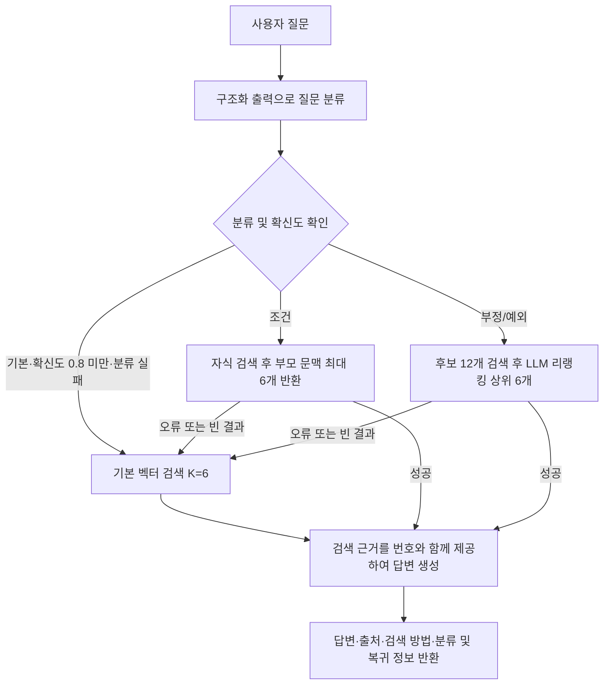

# Hmall 협력사 업무 Adaptive RAG 구현 및 평가

본 문서는 [mini_project_week1.txt](mini_project_week1.txt)의 네 가지 요건에 맞춰 [mini_project_final.ipynb](mini_project_final.ipynb)의 실제 코드와 저장된 평가 결과를 정리한다. 평가를 새로 실행한 보고서가 아니라 노트북에 기록된 구현·실험 결과의 설명이다. Streamlit은 향후 연결할 UI이며, 현재 구현 완료 항목으로 포함하지 않는다.

## 1. 데이터 수집·Ingestion 과정과 의사결정 근거

### 1.1. 도메인과 대상 데이터

현대홈쇼핑·Hmall 협력사가 입점, 광고, 시스템 사용, 품질검사 및 상품 소구에 필요한 정보를 찾도록 하는 문서 기반 RAG를 구성했다. 입력 데이터는 `files/`에 저장한 PDF 8종이며, 외부 업무 API를 질의하는 구조는 아니다. OpenAI API는 문서 파싱, 임베딩, 질문 생성·검수, 답변 생성 및 평가에 사용한다.

| 문서 | 페이지 | 실제 적용 로더 |
|---|---:|---|
| 협력사 운영 통합 안내서 | 23 | PyMuPDF + Markdown |
| Hmall 소개서 | 30 | 하이브리드 VLM |
| 쇼라 소개서 | 22 | 하이브리드 VLM |
| 광고 상품 소개서 | 24 | 하이브리드 VLM |
| 협력사시스템 사용법 | 10 | 하이브리드 VLM |
| 신규 협력사 입점 절차 안내 | 21 | 하이브리드 VLM |
| 데이터 영역 광고 제안서 | 8 | 하이브리드 VLM |
| QA가이드 | 38 | PyMuPDF + Markdown |
| 합계 | 176 | 문서별 선택 |

문서 목록과 페이지 수는 노트북의 대상 문서 설명을 기준으로 한다. 로더 선택은 `PDF_CONFIGS`에 명시되어 있으며, 파일명 앞의 문서번호로 설정을 조회한다. 로더 설정이 빠진 문서는 조용히 누락하지 않고 오류로 알린다.

### 1.2. 로더 비교와 선택 이유

PyPDF, PDFPlumber, PyMuPDF, PyMuPDF + Markdown, 하이브리드 VLM을 문서별로 비교했다. 전체문자수뿐 아니라 마크업을 제외한 순수문자수, 마크다운 표 수, 표 정합성, 첫 열 값의 반복 비율, 실행 시간 및 API 비용을 확인했다. 표 수와 문자수가 많아도 실제 행·열 대응이 깨질 수 있으므로 파싱된 표 본문을 직접 확인하는 셀을 마련했다.

- **쇼라 소개서·협력사시스템 사용법:** 로컬 로더의 추출량이 각각 0자, 6자 수준인 이미지 중심 문서여서 VLM을 선택했다.
- **Hmall·광고 상품·신규 입점·데이터 광고 문서:** 표 복원이나 내용 회수에 VLM이 필요하다고 판단했다. 특히 광고 단가표의 행·열 대응이 무너지면 가격 질문에 답할 수 없으므로 표 구조를 우선했다.
- **협력사 운영 안내서·QA가이드:** 로컬 로더를 적용해 파싱 비용을 줄였다. QA가이드의 일부 표 행 손실은 알려진 절충이며, 전체 원문이 완전하게 보존되었다고 주장하지 않는다.

하이브리드 VLM은 같은 페이지의 이미지와 PDF 텍스트 레이어를 함께 제공한다. 이미지에서 구조를 읽고 텍스트 레이어에서 철자를 보존하도록 지시한다. 표는 마크다운으로 복원하고 `#### 표 행 풀어쓰기`를 덧붙여 행의 값을 문장으로도 남긴다. 표·스캔 페이지에는 상위 모델, 그 외에는 경량 모델을 선택한다.

페이지 결과는 `md_cache/`에 저장한다. 캐시 키에는 파일명, 페이지, 모델, DPI, 프롬프트 버전을 포함하며 기본 실행에서는 기존 결과를 재사용한다. 이는 Streamlit의 `st.cache_resource`가 아니라 디스크에 저장하는 파싱 결과 캐시다. 현재 키는 파일 내용 해시를 포함하지 않으므로 같은 이름의 PDF를 교체할 때 캐시 관리가 필요하다.

### 1.3. 전처리와 청킹

로더 결과를 페이지 단위 `Document`로 통일하고 `source`, 1부터 시작하는 `page`, `loader` 메타데이터를 부여한다. 목차 제목, 점선 리더, 다수의 페이지 참조로 목차를 판별한다. 짧은 페이지는 문서 앞 두 페이지 또는 마지막 페이지인 경우에만 표지·맺음말 후보로 제외해 짧은 본문이 잘리는 일을 줄인다. 제외 페이지와 사유를 출력해 확인할 수 있다.

| 단계 | 설정 | 선택 이유 |
|---|---|---|
| 1차 분할 | `MarkdownHeaderTextSplitter`, `#`·`##`, 제목 유지 | 절의 제목과 계층을 본문·메타데이터에 보존 |
| 2차 분할 | `RecursiveCharacterTextSplitter`, 900자·겹침 150자 | 입력 문맥 크기를 제한하고 경계의 내용 손실 완화 |
| 분할 우선순위 | 문단 → 줄 → 공백 → 문자 | 가능한 의미 경계에서 분할 |
| 짧은 조각 제외 | 공백 제거 전 `strip()` 기준 30자 미만 제외 | 제목·표 끝 파편이 검색 상위를 차지하는 현상 완화 |

`####`는 헤더 분할 기준에 넣지 않아 표와 행 풀어쓰기가 헤더 분할 단계에서 분리되지 않게 했다. 다만 후속 길이 분할에서도 모든 표가 온전히 보존된다는 보장은 없다. 900/150은 현재 설계값이며, 모든 청크 크기를 실험해 최적이라고 확정한 값은 아니다.

### 1.4. 임베딩과 저장소

`OpenAIEmbeddings(model=EMBEDDING)`을 사용하고 Chroma의 `chroma_db/`, 기본 컬렉션 `langchain`에 저장한다. Chroma는 로컬 영속 저장과 메타데이터 필터를 사용할 수 있고 별도 서버 운영이 필요하지 않아 이 프로젝트 규모에 맞다고 판단했다. 임베딩 모델은 검색과 저장 과정에서 일치시킨다.

Adaptive Parent Document 경로는 별도로 부모 1,500자·겹침 0자, 자식 450자·겹침 75자를 사용한다. 자식은 `parent_document_children` 컬렉션, 부모는 `parent_document_store/`에 저장한다. 자식에 부모 ID와 설정 서명을 남기고 로딩 시 설정·부모 연결을 검증한다. 설정 불일치는 자동 재구축하지 않고 명시적인 재구축을 요구한다.

**노트북 확인 위치:** `1단계-A. PDF 로더 5종 비교`, `1단계-B. 로더 라우팅 · 청킹 · 벡터스토어`, `1단계-C. 벡터스토어 선택`, Adaptive 저장소 함수.

## 2. 골든 데이터셋 생성·큐레이션 과정과 의사결정 근거

### 2.1. 문항 수와 유형

기본 검색 능력과 협력사 업무 특유의 표·조건·예외·기한 이해를 구분하기 위해 8유형 22문항으로 구성했다.

| 유형 | 문항 수 | 평가하려는 능력 |
|---|---:|---|
| 단일홉 | 4 | 한 근거에서 사실 찾기 |
| 멀티홉 | 3 | 서로 다른 페이지의 근거 결합 |
| 표 | 3 | 행 조건에 맞는 열 값 찾기 |
| 집계 | 3 | 항목 개수와 전체 목록 정확히 제시 |
| 조건 | 2 | 수행 요건·필수자료 파악 |
| 부정/예외 | 2 | 금지·제외·예외 규정 파악 |
| 시점/기한 | 2 | 기한·기간·D-day 파악 |
| 무답변 | 3 | 근거 없는 질문에 답변 기권 |
| 합계 | 22 | 답변가능 19문항 + 무답변 3문항 |

문항 수는 유형별 동작과 실패 사례를 확인할 수 있는 소규모 실험 범위로 정했다. 실제 업무의 질문 빈도 분포를 재현한 데이터셋은 아니다.

### 2.2. 근거 선택과 초안 생성

Chroma에서 150자 초과 본문 청크를 가져오고 `random.seed(42)`로 샘플링 순서를 고정한다. 단일홉은 일반 청크에서 균등 간격으로, 멀티홉은 유사도 검색으로 다른 페이지의 근거 쌍을 선택한다. 표는 최소 3열의 마크다운 표를 대상으로 헤더 시그니처 중복을 줄이고 문서별 라운드로빈으로 고른다. 집계는 여러 항목이 열거된 청크, 조건·부정/예외·기한은 유형별 키워드를 가진 청크를 후보로 사용한다.

검수 탈락에 대비해 일반 유형은 목표의 3배, 표는 5배 후보를 준비한다. `GUIDES`에 유형별 생성 기준을 작성하고 `ChatOpenAI(model=MODEL, temperature=0.2)`와 구조화 출력 `Draft`를 사용해 질문, 정답, 원문 인용 목록, 난이도를 생성한다. 표 질문에는 복수 행 조건을 요구하고 빈 셀 질문은 금지한다.

생성 전 동일한 근거 조합의 중복을 줄이고, 최종 선택에서도 공백을 제거한 동일 질문을 제외한다. 이 절차가 모든 의미적 중복이나 근거의 부분 중복까지 제거하는 것은 아니다.

### 2.3. 검수와 최종 저장

1. **1차 인용 정합성:** 공백을 제거해 8자 이상 인용이 제공된 근거 안에 존재하는지 검사한다. 멀티홉의 인용도 목록으로 받지만, 실제 검사는 합친 근거 문자열 안의 존재 여부이며 근거별 일대일 대응을 별도로 보장하지 않는다.
2. **1.5차 정답 실질성:** 빈칸·공란·N/A 등 실질적 정보가 없는 정답을 제외한다.
3. **2차 자기완결성:** 심사 모델이 질문만으로 업무 대상·요구 정보·범위를 파악할 수 있는지 검사한다. 이 단계는 정답 정확성 자체를 심사하는 단계와 구분한다.
4. **3차 사용자 검수:** 질문·정답·인용·근거를 출력하고 `REJECT`에 후보 INDEX와 제외 사유를 기록한다. 실제 제외 사유에는 부자연스러운 질문, 협력사 업무와 부적합한 질문, 대상이 모호한 질문 등이 포함된다.
5. **최종 구성:** 유형별 목표 수를 선택하며 답변가능 문항은 hard → medium → easy 순으로 번갈아 배치한다. 결과와 검수 탈락 리포트를 확인하고 `golden_dataset.json`에 저장한다.

무답변 문항은 코드에 명시한 후보 질문을 검색 top-5와 심사 모델로 검증해 채택한다. 후보 자체를 자동 생성하는 방식은 아니다. 최종 무답변 질문은 현대백화점 오프라인 입점 절차, Hmall 2025년 연간 거래액 목표, 쇼호스트 회당 출연료다. 상위 검색 결과에 답이 없다는 검증이므로 전체 PDF에 답이 전혀 없다는 완전 탐색 증명은 아니다.

### 2.4. 신규 검증셋

기존 문항에서 고른 후보가 같은 문항에만 잘 맞는지 확인하기 위해 조건 5문항, 부정/예외 5문항을 추가했다. 기존 `GUIDES`와 청크 선택 기준을 재사용하고 원문 인용, 정답·필수 항목의 근거 지지, 자기완결성, 신규성·유형 적합성을 검수했다.

조건 P1·R1은 동일한 신규 조건 5문항으로 비교한다. 확정한 신규셋은 후보 답변에 맞춰 교체하지 않고 `golden_validation/`의 JSON으로 저장·재사용한다. 다만 후보 선택에 사용한 검증셋이므로 최종 선택과 독립된 별도 테스트셋은 아니다.

**노트북 확인 위치:** `2단계. 골든 데이터셋 생성 및 큐레이션`, 3차 사용자 검수·최종 구성, `7-6. 통과 유형의 신규 5문항 생성·검수`.

## 3. 실제 RAG workflow와 구성 이유

### 3.1. 기본 검색기와 K 선정

기본 검색, BM25, MMR 등을 비교한 뒤 벡터 유사도 검색을 BASE로 선택했다. K=1~10에서 Recall, nDCG, quote coverage의 동일 가중 평균을 계산하고 최고점에서 절대 0.01 이내인 후보 중 문맥 입력 비용 효율이 높은 K를 선택해 **K=6**을 사용했다.

검색 평가의 관련 근거는 골든 인용문 일치로 판단하며 ` `와 공백을 정규화한다. 의미가 같은 다른 표현은 놓칠 수 있다. K 비교의 검색은 최대 K를 한 번 가져와 접두 결과를 사용하므로 검색 지연을 K별 실측 시간으로 해석하지 않는다.

### 3.2. 패턴 비교에서 최종 정책까지

Pre-retrieval에서는 재작성, 질의 분해, HyDE, Step-back, 확장, 메타데이터 라우팅, 조건·예외 구조화를 비교했다. Retrieval에서는 Hybrid RRF, Ensemble, Parent Document, Sentence Window, Auto-merging을 비교했다. Post-retrieval에서는 Cross-Encoder·LLM 리랭킹, 임베딩 필터, LLM 문맥 추출, MMR 등을 비교하고 근거 위치 영향도 별도로 진단했다.

질의 분해는 분해한 질의별 검색 결과를 RRF로 통합하고, Step-back은 원질문과 일반화 질문의 검색 결과를 RRF로 통합해 최대 6개를 선택한다. Post-retrieval의 K=6은 모든 기법에 동일한 반환 개수를 강제하는 설정은 아니다. 리랭킹은 후보 12개에서 최대 6개를 선택하고, 임베딩 필터는 유사도 0.4를 넘는 후보를 최대 12개 반환한다. LLM 문맥 추출은 상위 6개 청크를 입력받아 관련 내용이 없는 청크를 제외할 수 있으며, MMR은 후보 36개에서 최대 6개를 선택한다.

최종 후보 평가에서는 조건 P1(구조화 질의)·R1(Parent Document), 집계·부정/예외·시점/기한 S1(LLM 리랭킹)을 명시적으로 선택했다. 이후 신규 검증은 조건 P1·R1과 부정/예외 S1에 수행했고, 사용자가 품질·위험·비용과 실제 답변을 확인해 조건 R1, 부정/예외 S1을 승인했다. 따라서 모든 패턴을 최종 서비스에 함께 넣은 구조가 아니다.

### 3.3. Adaptive RAG 실행 흐름

분류기는 `기본`, `조건`, `부정/예외`와 확신도·분류 이유를 구조화 출력으로 반환한다. 확신도 0.8은 분류 모델의 자기보고 값에 적용한 정책이며, 보정된 정확도 확률이 아니다. 필수자료와 금지·예외 판단을 각각 요구하는 혼합 질문은 기본 경로를 사용하도록 명시했다.

- **조건 → Parent Document:** 작은 자식으로 검색하고 넓은 부모를 반환해 제출자료·조건 주변 문맥을 확보한다. 자식 최대 12개를 검색하고 부모 ID 중복을 제거해 최대 6개 부모를 반환한다.
- **부정/예외 → LLM 리랭킹:** 기본 검색으로 후보 12개를 확보하고 질문에 유용한 순서로 정렬한 6개를 사용한다. 유효하지 않은 문맥 번호는 제거한다.
- **기본 및 복귀 → BASE:** 일반 사실·금액·목록·기한·혼합 질문에는 기본 벡터 검색을 사용한다. 특수 경로 실패 시 기본 검색을 한 번 수행한다. 기본 검색 자체의 실패와 답변 생성 실패는 호출자에게 전달한다.

최종 답변은 검색 근거만 사용하고 근거가 없으면 `제공된 문서에서 정보를 찾을 수 없습니다.`라고 기권하도록 지시한다. 사실에는 `[1]`, `[2]` 인용을 붙이고 금액·기간·조건의 원문 표기를 유지하며 표의 다른 행을 혼동하지 않도록 한다. 이는 프롬프트에 의한 지침이며 정확성을 강제하는 별도의 완전성 검증 단계는 아니다.

`prepare_adaptive_resources()`가 자원을 준비하고 `build_adaptive_graph()`가 LangGraph를 컴파일한다. `run_adaptive_rag(question, graph=...)`는 질문마다 새 상태를 만들어 실행하고 답변, 문서·출처, 검색 방법, 분류·복귀 추적 정보를 반환한다. 현재는 단일 질문 처리와 `invoke()` 기반 완성 답변 반환이며 대화 이력 기반 후속 질문 해석·토큰 스트리밍은 별도 구현 대상이다.

**노트북 확인 위치:** K값·검색기 결정, pre/retrieval/post 패턴 비교, `7. 최종 평가 및 선정`, `4단계. Adaptive RAG (라우팅) 적용`.

## 4. 골든 데이터셋 성능 측정과 결과 설명

### 4.1. 평가 조건과 지표

최종 Adaptive 평가는 기존 골든 22문항에서 단회 수행했다. 생성 모델은 저장된 출력 기준 `gpt-5.4-mini`, 심사 모델은 `gpt-5.5`다. K, 임베딩 모델, 생성·심사 모델, 답변 프롬프트, 골든셋·DB 해시 등을 확인해 기존 BASE 결과와 비교 조건을 맞춘다. 실제 라우팅을 포함한 그래프 답변을 생성한 뒤 그 답변으로 평가하며 평가 단계에서 답변을 다시 생성하지 않는다.

| 지표 | 대상 | 의미와 해석 범위 |
|---|---:|---|
| Faithfulness | 답변가능 19문항 | 생성 주장이 검색 근거로 지지되는지 평가. 검색에서 누락한 필수정보의 완전성까지 보장하지 않음 |
| Answer relevancy | 답변가능 19문항 | 질문과 답변의 관련성 평가 |
| Context precision with reference | 답변가능 19문항 | 참조 정답에 유용한 근거가 상위에 있는지 평가 |
| Context recall | 답변가능 19문항 | 참조 정답에 필요한 정보가 검색 문맥에 포함되는지 평가 |
| CitationFormat | 답변가능 19문항 | `[n]` 인용 존재와 검색 문맥 범위 내 번호인지 검사. 인용 내용의 진실성 검사와 구분 |
| BusinessSafetyScore | 전체 22문항 | 오류·누락이 업무 수행에 미치는 위험을 평가하며 위험 수준·이유도 기록 |

표준 RAGAS 4지표에 커스텀 2지표를 더했다. 근거 충실도만으로 필수 제출자료 누락·잘못된 업무 행동을 포착하기 어렵기 때문에 업무 위험 지표를 포함했다. 여섯 지표의 완료 결과가 저장되어 있다.

### 4.2. 신규 검증 결과와 선택 근거

| 후보 | 주요 신규 검증 결과 | 결정 |
|---|---|---|
| 조건 P1: 구조화 질의 | 충실도·재현율·업무 안전성 하락, 위험≥2 문항 증가 | 최종 조건 경로로 선택하지 않음 |
| 조건 R1: Parent Document | 충실도 0.95 유지, 재현율 1.0 유지, 업무 안전성 0.867 유지, 정밀도 0.560→0.780, 관련성 0.866→0.777 | 정밀도 개선과 다른 주요 지표 유지를 근거로 선택. 추정 비용 약 1.48배 |
| 부정/예외 S1: LLM 리랭킹 | 재현율 0.8→1.0, 업무 안전성 0.733→1.0, 위험≥2 문항 2→0개, 충실도 0.827→0.802 | 하락 문항의 답변·근거를 확인한 후 선택. 추정 비용 약 2.57배 |

평균 지표가 전부 상승해야 하는 자동 통과 규칙은 사용하지 않았다. 실제 문항과 하락 원인을 확인하고 승인 여부·이유를 코드에 기록했다.

### 4.3. 최종 기존 22문항 결과

| 항목 | BASE | Adaptive RAG | 변화 |
|---|---:|---:|---|
| Faithfulness | 0.9662 | 0.9825 | +0.0163 |
| Answer relevancy | 0.7802 | 0.8006 | +0.0205 |
| Context precision | 0.7342 | 0.8412 | +0.1070 |
| Context recall | 0.8947 | 0.9474 | +0.0526 |
| CitationFormat | 0.9474 | 1.0000 | +0.0526 |
| BusinessSafetyScore | 0.9091 | 0.9242 | +0.0152 |
| 평균 지연 | 1.82초 | 2.52초 | 약 38% 증가 |
| 질의당 추정 비용 | $0.002088 | $0.003430 | 약 64% 증가 |
| 위험 수준 2 이상 | 2문항 | 1문항 | 1문항 감소 |
| 위험 수준 3 | 0문항 | 1문항 | 1문항 증가 |

시간·비용은 전체 22문항의 평균이며 분류·검색·리랭킹·답변 생성을 포함하고 인덱스 구축·RAGAS 심사는 제외한다. USD는 노트북 `PRICES` 설정과 토큰 계측에 따른 추정치이며 최신 공식 가격이나 실제 청구액으로 해석하지 않는다.

실제 경로는 기본 검색 19문항, Parent Document 2문항, LLM 리랭킹 1문항이었다. 이 실행에서는 BASE 복귀가 발생하지 않았으므로 실패 복귀 동작의 실증 결과로 볼 수는 없다. 무답변 3문항은 모두 정해진 기권 답변을 반환했다.

### 4.4. 개선 사례와 남은 실패

**조건 질문 개선:** NFC 주스의 ‘정제수 없이 통째로 착즙’ 소구 제출자료 질문에서 BASE는 정보를 찾지 못했다고 답했으나 Parent Document 경로는 원물 투입 후 주스 추출 사진·동영상 제출 요건을 안내했다. 기존 조건 2문항 평균은 재현율 0.5→1.0, 정밀도 0.458→1.0, 업무 안전성 0.667→1.0으로 개선됐다. 충실도는 0.833으로 동일하다.

**필수자료 누락:** `original-16`은 항균 제품의 필수 제출자료와 균주 조건을 함께 묻는다. 참조 정답의 `환경부 표시광고 스크리닝 피드백`을 누락하고 `항균 시험성적서`를 제출해야 한다고 답했다. 위험 수준은 BASE 2→Adaptive 3으로 상승했다. 골든 유형은 부정/예외지만 실제 분류는 혼합 질문을 위한 기본 경로였으므로 이 사례를 LLM 리랭킹 경로의 실패라고 단정하지 않는다. 골든 유형별 집계와 실제 경로별 성능은 구분해야 한다.

이 사례는 검색 근거에 충실한 답변도 업무에 필요한 필수정보를 놓칠 수 있음을 보여준다. 전체 평균 안전성이 개선되고 위험≥2 문항이 줄었더라도 위험 수준 3의 신규 발생을 함께 설명해야 한다.

### 4.5. 결과의 한계와 적용 판단

- 기존 22문항 단회 결과이며 조건·부정/예외는 각각 2문항이다. 반복 변동이나 실제 질문 분포를 충분히 대표하지 않는다. 과제는 반복 횟수를 팀이 판단하도록 하므로 단회 수행 자체는 요건에 부합한다.
- 기존 문항은 K·후보·정책 선정에도 사용했다. 신규 10문항으로 별도 사례를 검증했지만 신규셋 역시 후보 선택에 사용했으므로 완전히 독립된 최종 테스트는 아니다.
- 기본 경로에서도 답변을 새로 생성했으므로 전체 평균 개선을 모두 특수 검색 경로의 효과로 설명할 수 없다. 생성·심사 변동이 포함된다.
- Sentence Window 등 중간 검색 실험에서는 중복 창과 관련 청크 분모 차이로 Recall·nDCG가 1을 넘는 결과가 있었다. 이를 일반적인 성능 우위로 해석하지 않고, 최종 답변 평가와 구분했다.
- 로컬 QA 파싱의 일부 표 손실, 필수자료 누락, 소규모 표본은 남은 개선 대상이다. 로더 설명에 혼재된 비용·표 개수는 최종 발표에서 동일 실행 기준으로 통일할 필요가 있다.

**판단:** 과제용 Streamlit 챗봇으로 연결해 답변·출처·실제 검색 경로를 시연하기에 적절하다. 실제 협력사 업무 적용을 확정하기 전에는 필수자료 누락과 혼합 질문의 근거 확보를 개선하고 신규 문항으로 재평가해야 한다. 자원 준비·그래프 구성은 `st.cache_resource` 후보이며 질문별 실행은 캐싱하지 않고, 대화 기록은 세션별로 보관한다. 이는 향후 UI 설계 방향이며 현재 노트북에 구현된 Streamlit 기능은 아니다.

**노트북 확인 위치:** `7. 최종 평가 및 선정`, 신규 검증 진단·수동 승인, `6. 기존 22문항의 Adaptive RAG 최종 RAGAS 평가`.

## 과제 설명용 결론

현대홈쇼핑 협력사 PDF 8종의 특성에 따라 로컬·VLM 로더를 선택하고, 헤더와 출처를 보존한 청킹·Chroma 저장소를 구성했다. 8유형 22문항을 생성·검수해 검색과 답변 성능을 측정하고, 다양한 RAG 패턴 비교 및 신규 10문항 검증을 거쳐 조건 질문에는 Parent Document, 부정/예외 질문에는 LLM 리랭킹을 연결했다. 최종 단회 평가에서 평균 품질은 개선됐지만 응답 시간·비용이 증가했고 혼합 질문의 필수 제출자료 누락이 남았다. 따라서 Streamlit 시연에 적용하되 추가 검증이 필요한 업무 지원 프로토타입으로 설명한다.
